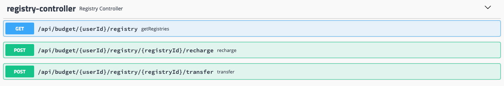

####Build status:

[](https://app.codeship.com/projects/425749)


####Tested on:
- MacOS 11.1
- JDK Corretto Build 11.0.8.10.1
- Apache Maven 3.6.3

####Compile:
````
mvn clean install
````

####Run:
````
cd target
java -jar wallet-1.0-SNAPSHOT.jar
````

####API Docs & Tryout:

- For Tryout and Api DOCs visit: (Sample data is available for userId: "1") 

````
http://localhost:8080/swagger-ui.html
````




- CLI example:

```
curl -X GET "http://localhost:8080/api/budget/1/registry" -H "accept: */*"

[
  {
    "id": "1",
    "label": "Wallet",
    "amount": 1000
  },
  {
    "id": "2",
    "label": "Savings",
    "amount": 5000
  },
  {
    "id": "3",
    "label": "Insurance Policy",
    "amount": 0
  },
  {
    "id": "4",
    "label": "Food Expenses",
    "amount": 0
  }
]
```

####Registries Reset
- to reset registries to default, remove "data" directory. For example if application has been executed inside target/ directory, to reset data one must remove target/data/